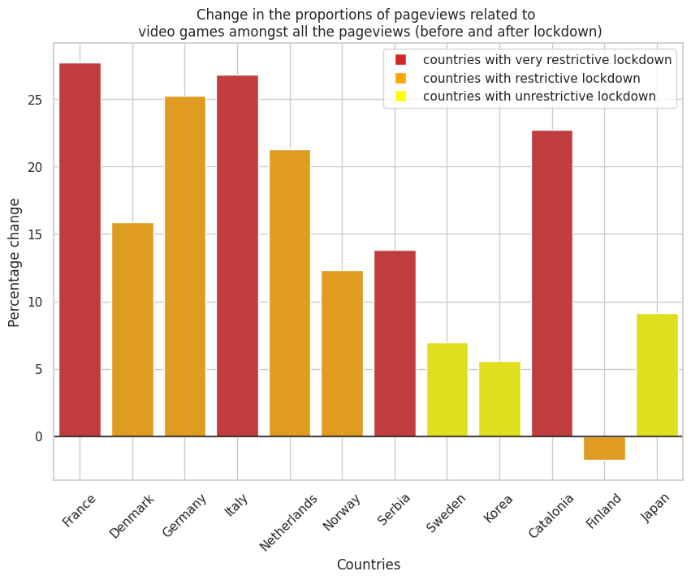

In this part we will analyze the mobility change of each country during in the begeinning the year 2020 and the , which corresponds to the Covid-19 period and the first lockdown in most of the countries around the world.

# Mobility pattern
First, to be able to analyze the relationship between mobility and attention towards videogame, we need first to get the mobility data for different country.
\n
The plot below present the average mobility between the 2020-02-15 and the 2020-08-25	for France, Denmark, Germany, Italy, Netehrlands, Norway, Serbia, Sweden, South Korea, Catalonia (Barcelona), Finland and Japan. We also have differents line that present important dates of this period.   

Thus, we can see that for most of the country, the start of the lockdown was really break in the mobility pattern. Indeed, if we take France as an exmaple, the mobility decreased by around 70% after the beginning of the lockdown. However, some countries like Japan the decrease is less likely noticeable.

Therefore, if we want to see if the mobility change has an impact on the attention towards videogames, can't consider all the countries has one group but we need to group them according to thir "lockdown Intensity".

# Clustering countries

The signal of the mobility patterns is very noisy and to be able to grouped them into different cluster we can first smooth the curves by using a polynomial approximation.

Thanks to these new smoothed curves, we can group the countries into 3 different categories of lockdown intensity: very restrictive, restrictive and unrestrictive.

We can see that there are 3 clear tendancies with very similar pattern. We have that France, Italy, Serbia and Catalonia (Barcelona) have had a huge decrease in mobility.

# Attention towards video games

Now that we have grouped the countries thanks to their moblity during the Covid-19 lockdown, we can get a measure of the attention shift towards video games during the same period.

The measures we are going to use to have an insight of the population attention towards video games are wikipedia pageviews related top the same topic. During the lockdown, people were most od the time at home, and thus got more free time than usual, which translate into a higher traffic on the wikipedia website overall. That is why it is not the absolute value of the pageviews that interest us in this section, but the percentage of views on video games related pages amongst all the wikipedia traffic.

The countries with which we chose to do the analysis speak a language that is mainly speaken only in this country. This way we can assume accurately that the mobility in a certain country is linked to the views on a page written in the official language of the country. For example, we can assume that only swedish people are using wikipedia pages written in swedish.

The following figure shows therefore the percentage of wikipedia pageviews related to video games in the same countries we have in the mobility part.

We can see that after the beginning of the lockdown it seems that certain countries experienced a rise in the attention toward video games. To have a better understanding of these curves, we can group them following the clustering we did previously in the mobility context.

If we plot the pageviews change percentage during 2 periods: approximately 2 months before the change in mobility and the lockdown period for each country, we get the following graph:

We can see that there is clear tendancy of increase in attention toward video games during the lockdown period as all the countries, except for Finland, experienced an increase in percentage of pageviews related to video games amongst all the wikipedia pageviews. Also, with this graph it's clear that the intensity of lockdown had an impact on the attention shift towards videogames. Indeed, the countries with an unrestrive lockdown (yellow: Sweden, Korea, Japan) experienced a small increase in attention compared to the 2 groups with a restrictive and very restrictive lockdown. It also seems like the red group (very restrictive lockdown) had a larger increase compared to the orange group (restrictive lockdown), but the difference is less likely to be significant than with the unrestictrive lockdown.

But is really this attention shift towards video games correlated to the mobility of people inside this country ? To answer this question, we can plot the correlation coefficient between the mobility time series and the wikipedia pegeviews time series. We get this plot:

According to this graph, the intensity of lockdown doesn't have an impact on the correlation value. Indeed, Japn and Korea that belongs to the group of unrestrictive lockdown have a high negative correlation that is statistically significant, as the the countries that belongs to the other groups.

What is interesting with this graph is that we can note that the countries with a very low and not significant correlation are the Norway, Sweden, Finland and Denmark, which are all the Scandinavian countries. It means that even though these countries experienced an increase of the video games page views percentage during the lockdown period (Norway and Denmark especially because Sweden experienced a very low increase and Finaland no increase at all) it's not related to the mobility decrease. For Denmark and Norway, the increase in views on wikipedia pages related to video games during confinement is simply part of an overall increase, not necessarily linked to the drop in moblity. That's why we notice an increase of videogames related pageviews during the lockdown but no correlation with the drop in mobility.

# Conclusion

Therefore, overall, 2 conclusions can be drawn from this analysis. First, the amount of decrease in mobility, and so the intensity of lockdown is indeed a factor of the attention shift towards videogames: the less the people are moving, the more they spend time playing videogames and doing research about it. The second statement is that, the first one doesn't include Scandinavian countries. These countries may have experienced an increase in videogames research proportionnally speaking, but it's not related to the mobility. 

However, we need to be aware of the limit of these conclusions. What we found is a correlation relation, not causiation one. It means that even if it seems like the drop in mobility may be the cause of the attention increase towards video games, maybe an other factor linked to the covid-19 that drives the increase in attetion.
